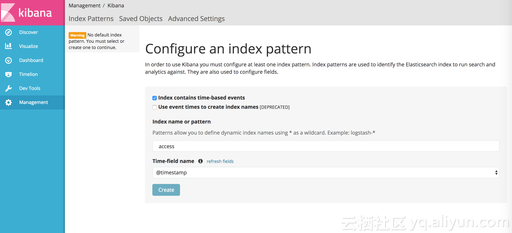
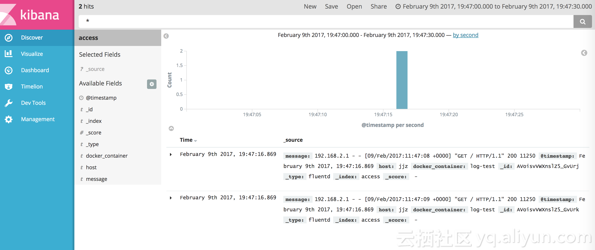
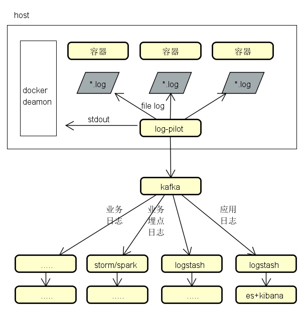
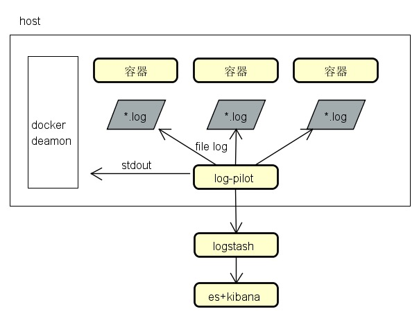

# docker 日志收集方案

容器日志采集：
* 基于docker api的日志流采集(stdout)；
* 日志文件采集（log file）

传统应用日志采集：
* 日志文件采集

工具选型：
* 支持文件日志和stdout
* 只支持文件日志
* 只支持stdout

| 工具名称 | 支持文件日志 | 支持stdout |使用感受 |
|--------|--------|--------|--------|
| log-pilot | yes| yes | 不错|
| filebeat | yes| no | 6.3.0版本总是读不到数据|
| logspout | no| yes | 他的stdout实现与log-pilot一样,调用的docker api
|docker log dirver| no| yes| dirver支持none/json-file/syslog/fluentd/..

日志采集工具要点：
* 尽量不要影响主机上的应用、占用资源越小越好，不过如果是容器应用的话倒是可以限制其使用的资源；
* 是否支持灵活的日志标记，这样可以方便后续归类和数据分析，目前看下来log-pilot还不错；

案例：
* tomcat既有stdout输出，也有文件日志输出(access.log)，这时你会选择哪个采集工具？
* java应用既有stdout输出(console)，也有文件日志输出(xxxx.log)，这时你会选择哪个采集工具？
* xxx应用，只有文件日志输出(xxxx.log)，这时你会选择哪个采集工具？

## log-pilot
限定容器资源、用docker-compose启动
准备环境

阿里开源：https://github.com/AliyunContainerService/log-pilot

log-pilot 具有如下特性：

* 一个单独的 log 进程收集机器上所有容器的日志。不需要为每个容器启动一个 log 进程。
* 支持文件日志和 stdout。docker log dirver 亦或 logspout 只能处理 stdout，log-pilot 不仅支持收集 stdout 日志，还可以收集文件日志。
* 声明式配置。当您的容器有日志要收集，只要通过 label 声明要收集的日志文件的路径，无需改动其他任何配置，log-pilot 就会自动收集新容器的日志。
* 支持多种日志存储方式。无论是强大的阿里云日志服务，还是比较流行的 elasticsearch 组合，甚至是 graylog，log-pilot 都能把日志投递到正确的地点。

### 采集输出到console
环境准备：一台主机  
步骤： 先启动一个 log-pilot，再启动一个 tomcat 容器

```shell
# 打开一个终端，启动log-pilot容器（不要关闭终端, 观察控制台日志）
docker run --name mypilot --rm -it \
    -v /var/run/docker.sock:/var/run/docker.sock \
    -v /:/host \
	--privileged  \
    registry.cn-hangzhou.aliyuncs.com/acs-sample/log-pilot:latest

# 打开一个终端，启动tomcat容器
docker run --name mytomcat -it --rm  -p 10080:8080 \
-v /usr/local/tomcat/logs \
--label aliyun.logs.catalina=stdout \
--label aliyun.logs.access=/usr/local/tomcat/logs/localhost_access_log.*.txt \
tomcat
```

说明：
* `aliyun.logs.catalina=stdout` 告诉 log-pilot 这个容器要收集 stdout 日志。
* `aliyun.logs.access=/usr/local/tomcat/logs/localhost_access_log.*.txt` 则表示要收集容器内 /usr/local/tomcat/logs/ 目录下所有名字匹配 localhost_access_log.*.txt 的文件日志。后面会详细介绍 label 的用法。

log-pilot 会监控 Docker 容器事件，当发现带有 aliyun.logs.xxx 容器时，自动解析容器配置，并且开始收集对应的日志。启动 tomcat 之后，会发现 log-pilot 的终端立即输出了一大堆的内容，其中包含 tomcat 启动时输出的 stdout 日志，也包括 log-pilot 自己输出的一些调试信息。

可以打开浏览器访问刚刚部署的 tomcat，您会发现每次刷新浏览器，在 log-pilot 的终端里都能看到类似的记录。其中 message 后面的内容就是从 /usr/local/tomcat/logs/localhost_access_log.XXX.txt 里收集到的日志。

```shell
# 打开一个终端，进入tomcat容器
docker exec -it -u root mytomcat /bin/bash
# 模拟浏览器访问tomcat
curl 127.0.0.1:8080
```

### 采集输出到ES+kibana
环境准备：一台主机(可以跟上面同一台主机)

部署ELK

```shell
# 先在宿主机上执行如下命令
sudo sysctl -w vm.max_map_count=262144

# 运行ELK容器
docker run -d -p 5601:5601 -p 9200:9200 -p 5044:5044 -p 9300:9300 -it --name elk sebp/elk:630

# 检查
浏览器访问kibana控制台  http://主机IP:5601
浏览器访问es  http://主机IP:9200
```

重启log-pilot

```shell
# 关闭前面运行的log-pilot
docker stop mypilot
docker rm mypilot

# 启动log-pilot，注意替换ES所在的主机IP地址
docker run --rm -it \
    -v /var/run/docker.sock:/var/run/docker.sock \
    -v /:/host \
    --privileged \
    -e FLUENTD_OUTPUT=elasticsearch \
    -e ELASTICSEARCH_HOST=172.17.0.3 \
    -e ELASTICSEARCH_PORT=9200 \
    registry.cn-hangzhou.aliyuncs.com/acs-sample/log-pilot:latest
```
相比前面启动 log-pilot 的方式，这里增加了三个环境变量：

* FLUENTD_OUTPUT=elasticsearch：把日志发送到 ElasticSearch。
* ELASTICSEARCH_HOST=${ELASTICSEARCH_HOST}：ElasticSearch 的域名。
* ELASTICSEARCH_PORT=${ELASTICSEARCH_PORT}：ElasticSearch 的端口号。

继续运行前面的 tomcat，再次访问，让 tomcat 产生一些日志，所有这些新产生的日志都将发送到 ElasticSearch 里。

打开 kibana，此时您还看不到新日志，需要先创建 index。log-pilot 会把日志写到 ElasticSearch 特定的 index下，规则如下：

如果应用上使用了标签 `aliyun.logs.tags`，并且 `tags` 里包含 `target`，使用 `target` 作为 ElasticSearch 里的 index。否则，使用标签 `aliyun.logs.XXX` 里的 `XXX` 作为 index。

在前面 tomcat 里的例子里，没有使用 `liyun.logs.tags` 标签，所以默认使用了 `access` 和 `catalina` 作为 index。我们先创建 index `access`。


创建好 index 就可以查看日志了。


### 使用编排文件运行log-pilot

log-pilot docker-compose.yml

```yaml
version: "2"
services:
    pilot:
      image: registry.cn-hangzhou.aliyuncs.com/acs-sample/log-pilot:latest
      volumes:
        - /var/run/docker.sock:/var/run/docker.sock
        - /:/host
    privileged: true
    environment:
      FLUENTD_OUTPUT: elasticsearch #按照您的需要替换
      ELASTICSEARCH_HOST: ${elasticsearch} #按照您的需要替换
      ELASTICSEARCH_PORT: 9200
      logging:
        driver: json-file
        options:
           max-size: "10m"
           max-file: "5"
    cpu_shares: 512  #限制CPU使用份额权重,默认1024
    mem_limit: 600m  #内存限制600M
    memswap_limit: 800m #内存+swap限制800M
      blkio_config:
        weight: 300 #限制读写磁盘带宽,默认500,取值0-1000
      networks:
        - webnet

networks:
    webnet:
       driver: bridge
```

查看限制的CPU、内存是否生效：

```shell
# 查看CPU
cat /sys/fs/cgroup/cpu/docker/<容器长ID>/cpu.shares

# 查看内存
cat /sys/fs/cgroup/memory/docker/<容器长ID>/memory.limit_in_bytes
cat /sys/fs/cgroup/memory/docker/<容器长ID>/memory.memsw.limit_in_bytes

# 或者直接查看容器详细信息
docker inspect <容器长ID>
```


tomcat docker-compose.yml

```yaml
version: "2"
services:
    mytomcat:
      image: tomcat:latest
      ports:
        - 8080:8080
      volumes:
        - /usr/local/tomcat/logs
      labels:
        - "aliyun.logs.catalina=stdout"
        - "aliyun.logs.access=/usr/local/tomcat/logs/localhost_access_log.*.txt"
      logging:
        driver: json-file
        options:
           max-size: "10m"
           max-file: "5"
      networks:
        - webnet

networks:
    webnet:
       driver: bridge
```

运行容器

```shell
docker-compose -f mylogpilot.yml up
docker-compose -f mytomcat.yml up
```

### label 说明
启动 tomcat 时，声明了下面两个 label 来告诉 log-pilot 这个容器的日志位置。

```shell
--label aliyun.logs.catalina=stdout
--label aliyun.logs.access=/usr/local/tomcat/logs/localhost_access_log.*.txt
```
您还可以在应用容器上添加更多的标签。

* `aliyun.logs.$name = $path`
  * 变量 `name` 是日志名称，只能包含 0~9、a~z、A~Z 和连字符（-）。
  * 变量 `path` 是要收集的日志路径，必须具体到文件，不能只写目录。文件名部分可以使用通配符，例如，`/var/log/he.log` 和 `/var/log/*.log` 都是正确的值，但 `/var/log` 不行，不能只写到目录。`stdout` 是一个特殊值，表示标准输出。
* `aliyun.logs.$name.format`：日志格式，目前支持以下格式。
  * none：无格式纯文本。
  * json：json 格式，每行一个完整的 json 字符串。
  * csv：csv 格式。
* `aliyun.logs.$name.tags`：上报日志时，额外增加的字段，格式为 `k1=v1,k2=v2`，每个 key-value 之间使用逗号分隔，例如 `aliyun.logs.access.tags="name=hello,stage=test"`，上报到存储的日志里就会出现 `name` 字段和 `stage` 字段。

  如果使用 ElasticSearch 作为日志存储，`target` 这个 tag 具有特殊含义，表示 ElasticSearch 里对应的 index。

### 最后的思考
* 采集到重复数据问题，比如采集程序重启之后，读到重复数据，是否有排重？根据什么规则排重？
* 采集数据是否会发生遗漏，比如采集程序重启之后，是否有标记最后读取的位置
* 采集输出到后端，是否有过滤，或者可以自定义过滤
* 采集输出到后端，是否尽量保证不丢失，采用的策略是什么

如果log-pilot做不到上述事情,或者扩展起来麻烦，则考虑自己写个agent, 起码自己写的程序，知道如何驾驭;


## 参考
* log-pilot官方  
https://github.com/AliyunContainerService/log-pilot  
https://helpcdn.aliyun.com/document_detail/50441.html  
* Docker日志收集最佳实践  
  https://yq.aliyun.com/articles/72700
* logspout   
https://github.com/gliderlabs/logspout
* logspout 网友扩展  
https://www.jianshu.com/p/bd482c13ea66

# 几种采集架构图
* 业务埋点数据、应用日志数据  
log-pilot->kafka->logstash->es->kibana  
log-pilot->kafka->storm/spark  


* 应用日志数据  
log-pilot->logstash->es->kibana   


* 采集文件日志
采集工具可以用log-pilot、filebeat、fluentd、flume、....

