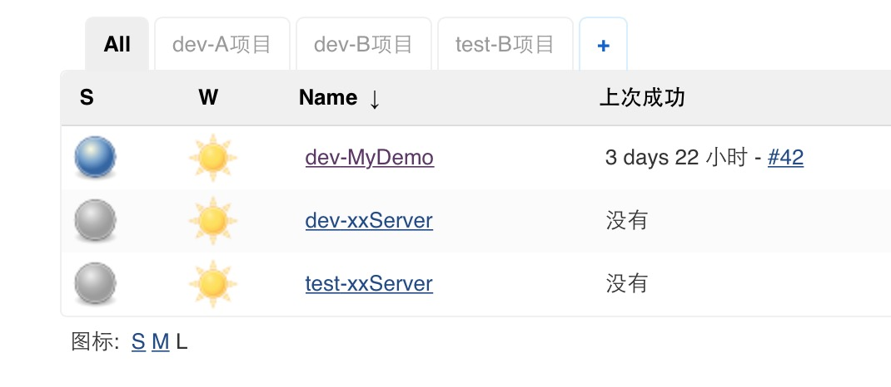
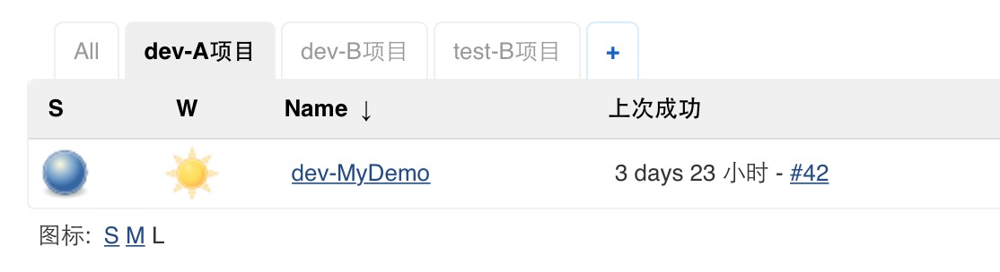
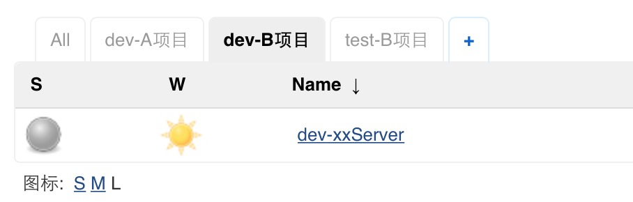
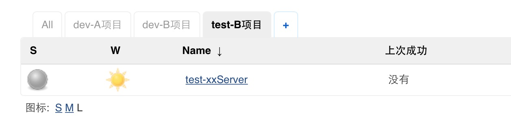
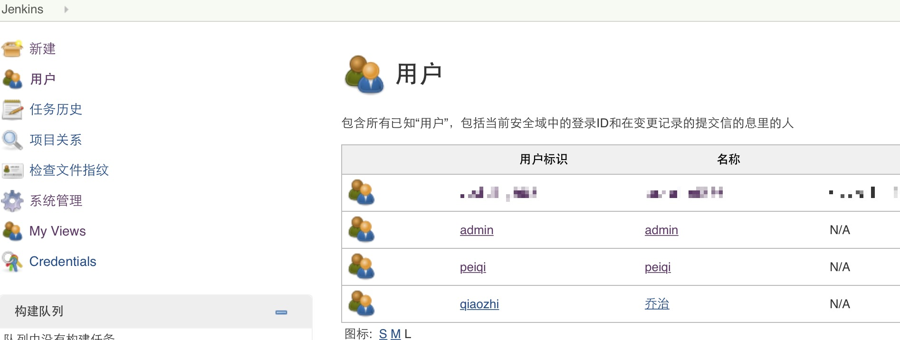
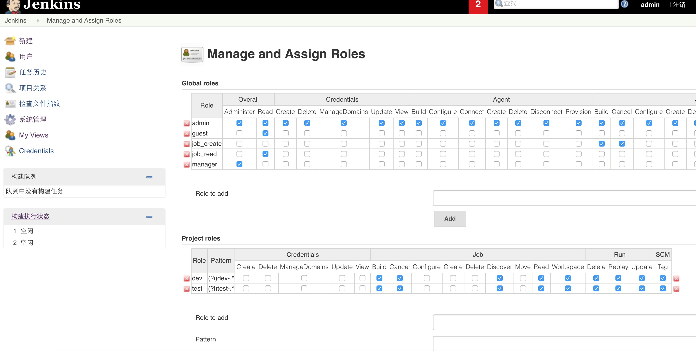
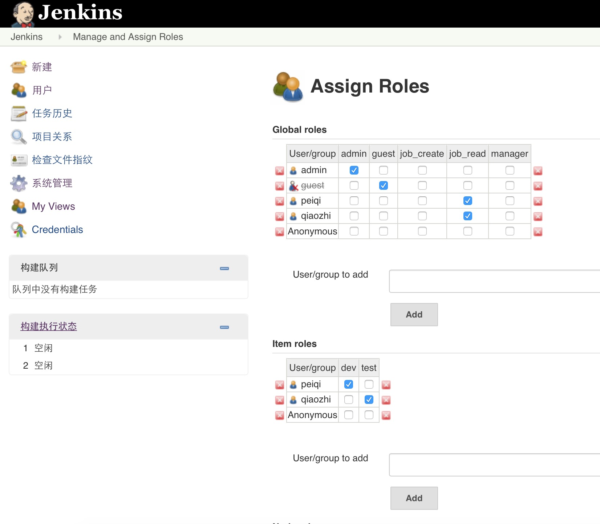
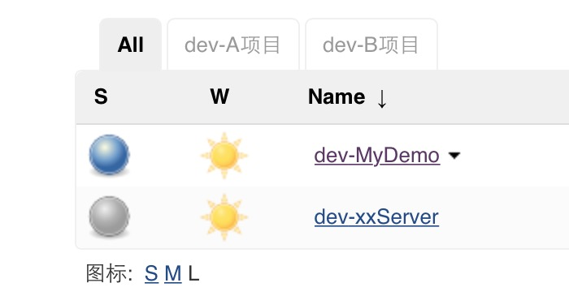
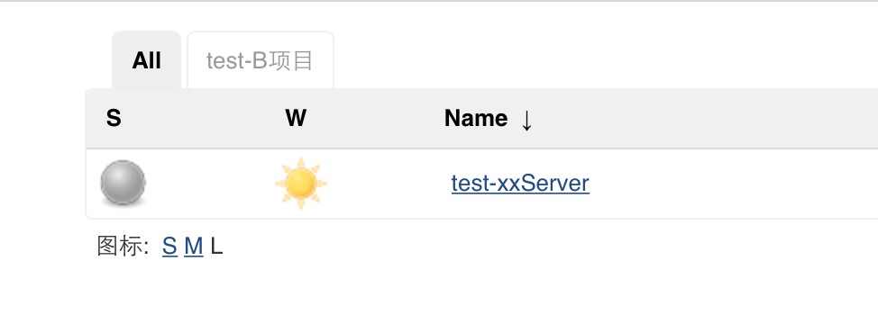
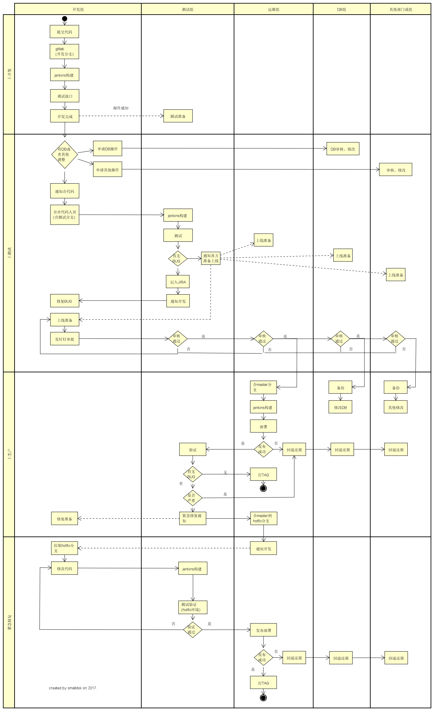

1、环境  
2、jenkins服务器与部署服务器SSH打通
3、jenkins配置  
4、部署服务器配置

附：服务端小组协作流程图

# 环境

| 服务器 | 安装 | 描述 |
| ---- | ---- | ---- |
| jenkins服务器|jenkins2.60.1|-|
|-|jdk1.8|-|
|-|git2.1.4|-|
|-|maven3|-|
| 部署服务器| centos6.6|7有BUG|
|-|jdk1.8|-|
|-|openssh-server|-|
|github项目例子|https://github.com/smalldok/springboot-jenkins|-|

# jenkins服务器与部署服务器SSH打通
主要是jenkins中可以远程执行部署服务器的SHELL脚本；  

`部署服务器` 启动SSH服务
```SHELL
rpm -qa |grep ssh #检查是否装了SSH包
#没有的话yum install openssh-server
chkconfig --list sshd #检查SSHD是否在本运行级别下设置为开机启动
chkconfig --level 2345 sshd on  #如果没设置启动就设置下.
service sshd restart  #重新启动
netstat -antp |grep sshd  #看是否启动了22端口.确认下.
iptables -nL  #看看是否放行了22口.
```

`jenkins服务器` 测试远程执行SHELL
```SHELL
#jenkins服务器上生产RSA公钥私钥对
#jenkens_home目录中的.ssh目录中运行命令
ssh-keygen -t rsa  #一直回车
ssh-copy-id -i smalldok@172.17.0.2 #传输公钥给需要访问的服务器

#jenkins服务器上测试：
ssh smalldok@172.17.0.2 "/home/smalldok/test.sh"
```

`test.sh`
```SHELL
#!/bin/sh
echo ">>>>>>>"
```


# jenkins 配置
### 安装插件
`jenkins 系统管理->插件管理`   
安装maven-intestrating-plugin(新建maven构建项目用)；  
安装Role-based Authorization Strategy(用户角色权限设置)；  
### jdk/git/maven设置
`jenkins 系统管理->Global Tool Configuration`  
分别设置jdk、git、maven
### 项目构建配置
见https://github.com/smalldok/springboot-jenkins.git

### 创建用户、分配权限、视图
jenkins权限管理，实现不同用户组显示对应视图views中不同的jobs ；
场景：  
隔离开发环境、测试环境、生产环境；  
开发人员构建开发环境的项目；  
测试人员构建测试环境的项目；  
运维人员构建生产环境的项目；  

`视图`  

| All | dev-A项目 | dev-B项目 | test-B项目|
| ---- | ---- | ---- | ---- |
| -|dev-MyDemo|-|-|
| -|-|dev-xxServer|-|
| -|-|-|test-xxServer|

即：  
开发人员登录jenkins只能看到dev-A项目、dev-B项目视图；
测试人员登录jenkins只能看到test-B项目视图；

`admin All视图`
  
`dev-A项目视图`
这个视图下，存放A项目的开发构建环境  
  
`dev-B项目视图`
这个视图下，存放B项目的开发构建环境  
  
`test-B项目视图`
这个视图下，存放B项目的测试构建环境
  

`分别创建如上三个视图`  
把项目加入到相关的视图中；  
开发的项目前缀，以dev-开头；  
开发的项目前缀，以test-开头；  

`创建用户（乔治、佩奇）`


`jenkins 系统管理->Manage and Assign Roles->Manage Roles`   

`jenkins 系统管理->Manage and Assign Roles->Assign Roles`   


`佩奇登录jenkins的效果`

`乔治登录jenkins的效果`


参考：http://blog.sina.com.cn/s/blog_8d8f99440101hpzb.html

### 配置备份
配置目录（jenkins_home）加入git版本库

# 部署服务器配置
目标服务器上，提前建好几个目录  
/home/smalldok/build  
/home/smalldok/backcup  
/home/smalldok/release

还需要一个deploy的shell  
见-> https://github.com/smalldok/springboot-jenkins.git

# 服务端小组协作流程图

