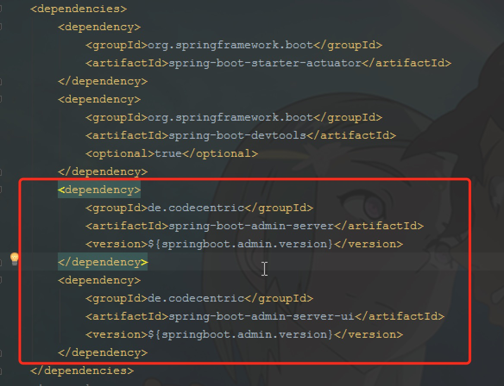
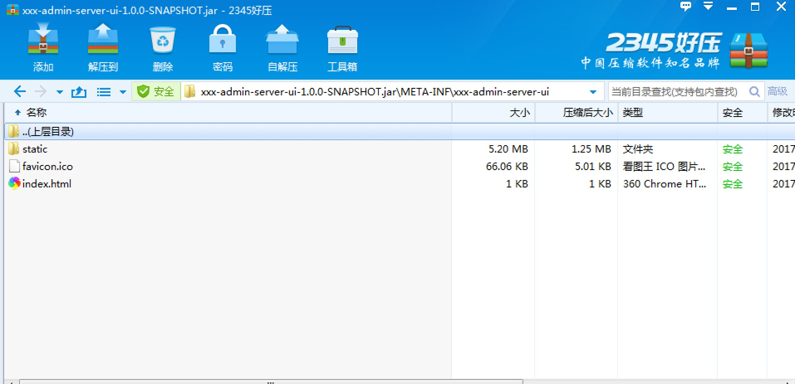
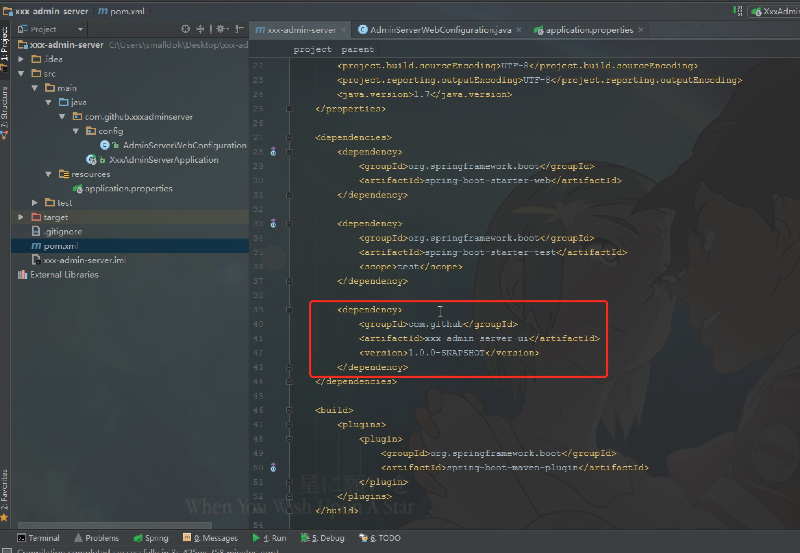
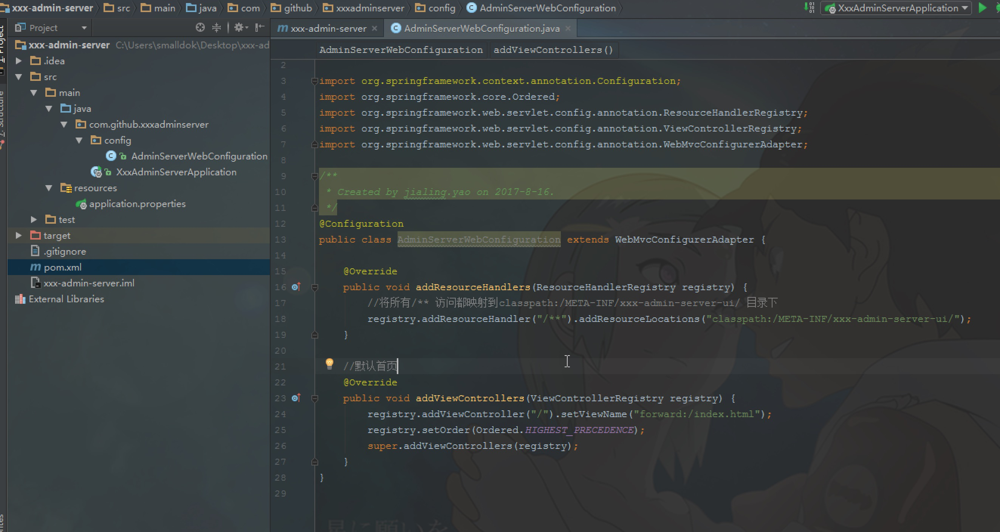
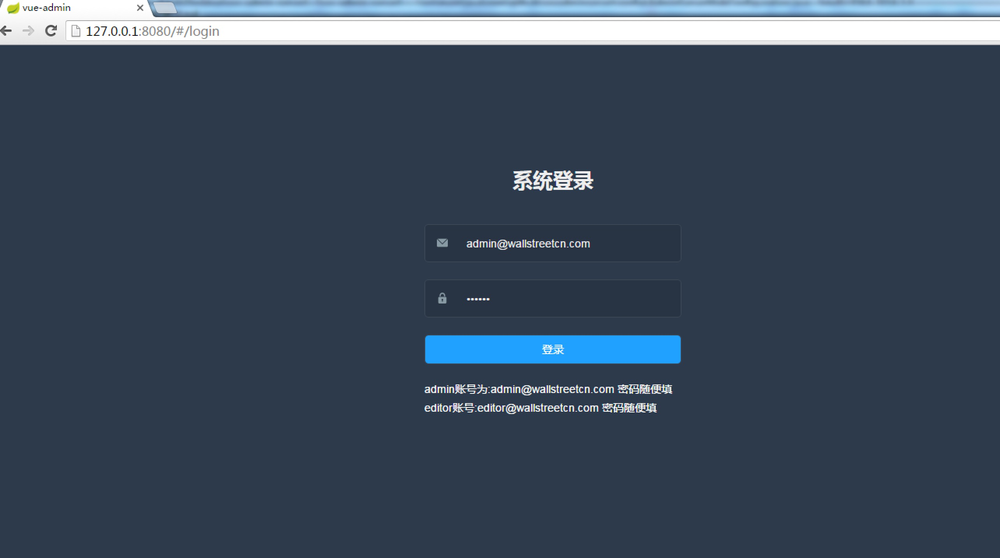

## 什么是WebJars
WebJars是将客户端（浏览器）资源（JavaScript，Css等）打成jar包文件，以对资源进行统一依赖管理。WebJars的jar包部署在Maven中央仓库上。

## 为什么使用
我们在开发Java web项目的时候会使用像Maven，Gradle等构建工具以实现对jar包版本依赖管理，以及项目的自动化管理，但是对于JavaScript，Css等前端资源包，我们只能采用拷贝到webapp下的方式，这样做就无法对这些资源进行依赖管理。  
如果我们将这些前端资源打成jar包，我们就可以进行依赖管理。

我们经常看到类似如下这种带管理后台的第三方工具，在springboot中这么使用： 
   

## springboot 处理静态资源知识
Spring Boot 默认将 /** 所有访问映射到以下目录：
```java
classpath:/META-INF/resources
classpath:/resources
classpath:/static
classpath:/public
```
优先级顺序为：META/resources > resources > static > public  

如果UI页面不放在这些默认目录，则需要在springboot webconfiguration中配置资源映射(本文就是采用资源映射方式)；  

参考：  
http://www.cnblogs.com/magicalSam/p/7189476.html  
https://github.com/codecentric/spring-boot-admin/blob/master/spring-boot-admin-server/src/main/java/de/codecentric/boot/admin/config/AdminServerWebConfiguration.java

## 找个web前端工程
* 一个管理后台前端项目
  http://panjiachen.github.io/vueAdmin-template
fork到我自己的github
https://github.com/smalldok/vueAdmin-template.git
* 在本地`git clone https://github.com/smalldok/vueAdmin-template.git`
* 进入vueAdmin-template目录，新建pom.xml文件
```java
<?xml version="1.0" encoding="UTF-8"?>
  <project xmlns="http://maven.apache.org/POM/4.0.0" xmlns:xsi="http://www.w3.org/2001/XMLSchema-instance" xsi:schemaLocation="http://maven.apache.org/POM/4.0.0 http://maven.apache.org/xsd/maven-4.0.0.xsd">
    <modelVersion>4.0.0</modelVersion>
	<groupId>com.github</groupId>
    <artifactId>xxx-admin-server-ui</artifactId>
	<version>1.0.0-SNAPSHOT</version>
	<packaging>jar</packaging> 
	
	<properties> 
		<project.build.sourceEncoding>UTF-8</project.build.sourceEncoding> 
		<java.version>1.7</java.version> 
	</properties>
	
    <build>
      <plugins>
        <plugin>
          <groupId>org.codehaus.mojo</groupId>
          <artifactId>exec-maven-plugin</artifactId>
          <executions>
            <execution>
              <id>yarn-install</id>
              <phase>validate</phase>
              <goals>
                <goal>exec</goal>
              </goals>
              <configuration>
                <executable>yarn</executable>
                <arguments>
                  <argument>install</argument>
                </arguments>
              </configuration>
            </execution>
            <execution>
              <id>yarn-build</id>
              <phase>generate-resources</phase>
              <goals>
                <goal>exec</goal>
              </goals>
              <configuration>
                <executable>yarn</executable>
                <arguments>
                  <argument>run</argument>
                  <argument>build</argument>
                </arguments>
              </configuration>
            </execution>
			<!--
            <execution>
              <id>yarn-test</id>
              <phase>test</phase>
              <goals>
                <goal>exec</goal>
              </goals>
              <configuration>
                <executable>yarn</executable>
                <arguments>
                  <argument>run</argument>
                  <argument>test</argument>
                </arguments>
              </configuration>
            </execution>
			-->
          </executions>
        </plugin>
        <plugin>
          <groupId>org.apache.maven.plugins</groupId>
          <artifactId>maven-resources-plugin</artifactId>
          <configuration>
            <nonFilteredFileExtensions>
              <nonFilteredFileExtension>woff</nonFilteredFileExtension>
              <nonFilteredFileExtension>ttf</nonFilteredFileExtension>
              <nonFilteredFileExtension>woff2</nonFilteredFileExtension>
              <nonFilteredFileExtension>eot</nonFilteredFileExtension>
              <nonFilteredFileExtension>swf</nonFilteredFileExtension>
              <nonFilteredFileExtension>ico</nonFilteredFileExtension>
            </nonFilteredFileExtensions>
          </configuration>
        </plugin>
      </plugins>
      <resources>
        <resource>
          <directory>dist</directory>
          <targetPath>META-INF/xxx-admin-server-ui</targetPath>
          <filtering>true</filtering>
        </resource>
      </resources>
    </build>
  </project>
```
* 安装jdk1.8、maven3（略）
* 安装nodejs（略）
* 安装yarn
1.执行命令`npm -i -g yarn`  
2.查看当前的源，默认是：官网 ,`yarn config get registry`
3.改成taobao的源,`yarn config set registry https://registry.npm.taobao.org`

* 执行`mvn  install` 
不出意外，会在本地maven仓库中生成`xxx-admin-server-ui-1.0.0-SNAPSHOT.jar`;
   
* 以上步骤，最好都在mac下操作

## springboot 集成前端
`http://start.spring.io`创建一个springboot项目，名字叫xxx-admin-server
* pom.xml配置
 
* web config
 
* 启动项目，访问`http://127.0.0.1:8080/`，最终效果
 