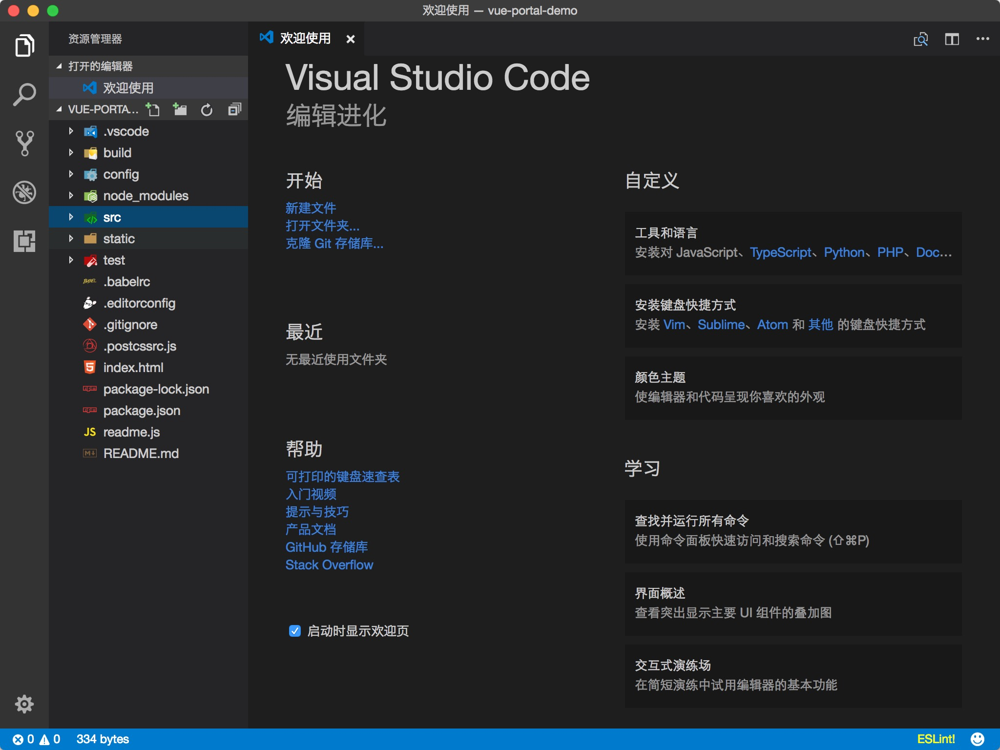

## 前端的一些开发工具
`vscode` `atom` `sublime text` `webstorm`

## mac vscode 安装
官网下载安装即可，略....  
`我安装后的效果`  
  

## 插件
* `vscode-icon`  
项目工程文件加上漂亮图标，方便识别，必备良品！  

* `Debugger for Chrome`  
映射 chrome 的 debug功能，静态页面都可以用 vscode 来打断点调试
* `vscode-fileheader`  
添加头部注释：作者、创建时间、最新修改时间;  
1、设置头注释，打开`.vscode/settings.json`，查找`fileheader`  
2、插入头注释快捷键ctrl+alt+i

* `beautify`  
格式化html，css，js
* `HTML Snippets`  
可以在不输入 < 的情况下提示
* `Git History`  
显示git log和line history

更多插件参考：  
[vscode 插件推荐 - 献给所有前端工程师](https://segmentfault.com/a/1190000006697219)

http://www.cnblogs.com/xwwin/p/6247765.html

## vscode 配置备份
这么多配置，不备份怎么行
> `方式一：备份到github gist`  
* github 上生成token，然后复制token  
* 上传备份  
vscode中按shift+alt +u  在弹出窗里输入你的token，然后会生成syncSummary.txt文件在窗口中打开；  
* 下载备份  
打开syncSummary.txt文件，找到`sync.gist`值；  
vscode中按shift+alt +d，在弹出窗里输入这个值；   
* 参考文章：  
[vscode同步设置&扩展插件](http://www.cnblogs.com/ashidamana/p/6761085.html)

> `方式二：备份github或者git oschina(分支形式)`  
* 在github或者git oschina创建一个项目
https://xxxx/smalldok/mybackup.git  
* 命令行，进入vscode安装目录  
* 备份  
git init  
git add .  
git commit -m "xxxxxxx"  
git checkout -b mac-vscode1.14.2
git remote add origin https://xxxx/smalldok/mybackup.git  
git push origin mac-vscode1.14.2
* 恢复  
git pull --rebase origin mac-vscode1.14.2

**`方式二`也是我自己备份电脑上各种配置的做法**