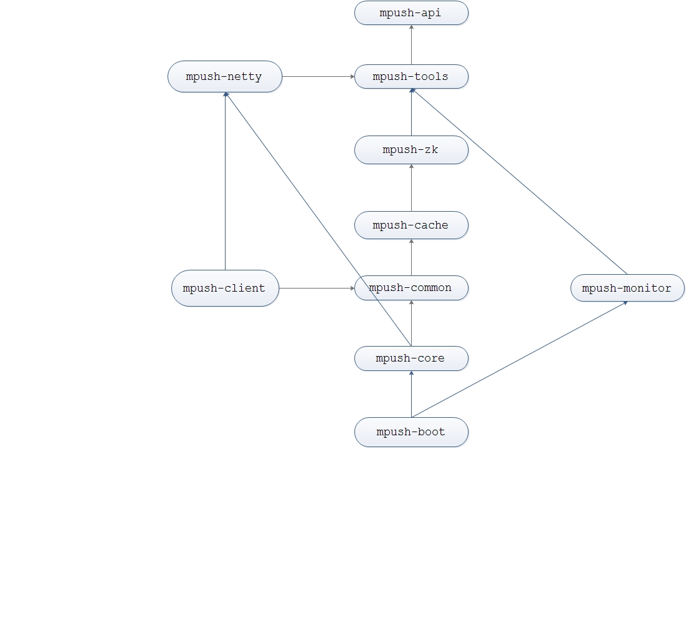

  

* mpush-client：服务端SDK,主要提供发送Push的接口给其他业务使用，比如MPNS
* mpush-boot：是服务端启动入口模块，主要控制server启动、停止流程
* mpush-api：定义了mpush相关核心接口及协议，还包括对外暴露的SPI接口
* mpush-netty：主要提供netty相关的一些基础类，像NettyServer,NettyClient
* mpush-tools：mpush用到的一些工具类，包括线程池，加密，配置文件解析等等
* mpush-zk：zookeeper的client, 包括path的定义，节点定义，数据监听等
* mpush-cache：redis缓存模块，支持单机模式和3.x集群模式，包括用户路由，上下线消息等
* mpush-common：定义了mpush-client模块和mpush-core模块都会用到的类，主要是消息、路由等
* mpush-core：sever核心模块，包括接入服务，网关服务，路由中心，推送中心等等
* mpush-monitor：服务监控模块主要监控JVM，线程池，JMX，服务状态统计，性能统计等
