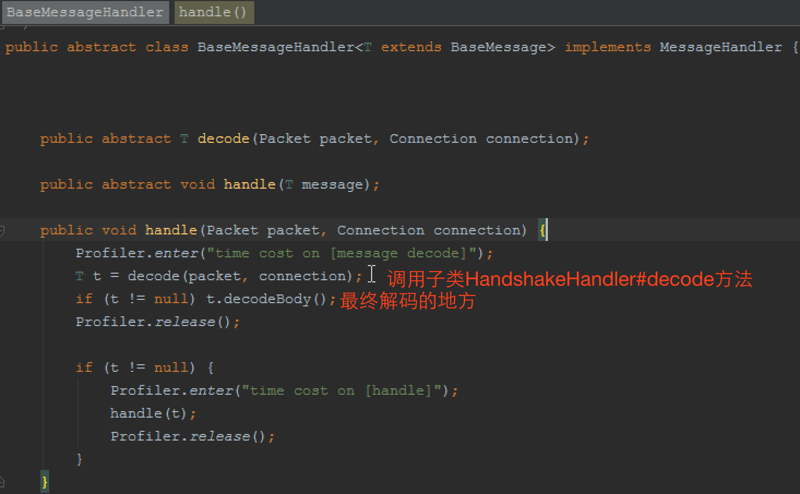

深度进阶-加解密    
1、数据交换过程   
2、RSA 加密解密      
3、AES 加密解密  
4、客户端-服务端-MPNS加密交互  
5、客户端-服务端-握手交互

# 数据交换过程   
## Mpush方案
1、算法上同时使用了非对称加密算法(RSA)和对称加密算法(AES)。  
2、在客户端预埋好由服务端生成好的公钥。  
3、客户端生成随机数R1，并通过RSA公钥加密后发送给服务端。  
4、服务端用RSA私钥解密客户端发送的数据取得R1,同时生成随机数R2,并以R1为Key使用AES加密R2然后把加密后的数据发送到客户端。  
5、客户端以R1为Key使用AES解密服务发送的数据取得R2  
6、此时客户端和服务的同时都拥有随机数R1、R2，然后使用相同的混淆算法生成会话密钥(sessionKey), 之后传输的数据都以此值作为AES加密的密钥。  
  
参考：http://mpush.mydoc.io/?t=134350  密钥交换章节

## 其他方案
针对日志的加密方案，我们充分考虑了对称加密和非对称加密各自的优缺点：对称加密加密与解密使用的是同样的密钥，所以速度快，但由于需要将密钥在网络传输，所以安全性不高；非对称加密使用了一对密钥，公钥与私钥，所以安全性高，但加密与解密速度慢。虽然非对称加密很安全，但是和对称加密比起来，它非常的慢，所以还是要用对称加密来传送报文，但对称加密所使用的密钥可以通过非对称加密的方式发送出去。流程如下：  
* APP 端首先生成了一个随机数作为对称密钥。  
* APP 端向服务端请求公钥。  
* 服务端将带版本号的公钥发送给 APP 端。  
* APP 端使用该版本的公钥将自己的对称密钥加密。  
* APP 端将加密后的对称密钥（带上公钥版本号）发送给服务端。  
* 服务端使用对应版本号的私钥解密得到 APP 端的对称密钥。  
* APP 端与服务端可以使用对称密钥来对沟通的内容进行加密与解密了。  

参考：https://mp.weixin.qq.com/s/iUwqQxx87qQeRecjGxwTtg  《苏宁用户行为采集体系的演变》

# RSA 加密解密     
mpush工程 -> mpush-tools模块  
RSAUtilsTest.java  

mpush工程 -> mpush-test模块  
RsaTest.java  

# AES 加密解密  
mpush工程 -> mpush-tools模块  
AESUtilsTest.java  

# 客户端-服务端-MPNS加密交互  
1、客户端向服务端下发消息，会加密；  
（参考工程mpush-client-java的MPushClient类）  
2、服务端向客户端返回消息，不会加密；  
（参考mpush工程，mpush-client模块的ConnClientChannelHandler）  
（参考mpush工程，mpush-core模块的ConnectionServer中各个***handler#handle方法）  
3、MPNS向服务端下发消息，会加密；  
4、服务端向MPNS返回消息，不会加密；  
5、服务端向客户端转发MPNS的消息，会加密；  

`总结：请求消息加密，响应消息不加密`

# 客户端-服务端-握手交互
  

  
服务端生成好RSA公钥私钥，并将公钥串给客户端的开发人员
  
1、客户端生成随机数R1，并通过RSA公钥加密后发送给服务端。

消息发送前，会经过编码、然后判断SessionContext中是否设置加解密类，如果设置了加解密类，则对消息体加密；

2和3、服务端用RSA私钥解密客户端发送的数据取得R1,同时生成随机数R2,并以R1为Key使用AES加密R2然后把加密后的数据发送到客户端。  
2 取得R1  
服务端ConnectionServer与客户端建立连接时(channelActive)，会设置SessionContext上下文中的加解密类为RSA；  

服务端ConnectionServer接收到客户端的握手消息，找到HandshakeHandler处理类，然后调用其父类中BaseMessageHandler#handle()方法

上面t.decodeBody()方法，是调用其父类BaseMessage#decodeBody方法；  
然后decodeBody方法会调用到decodeBinaryBody0方法，进行解码操作；

解密、解压之后，开始解码得到客户端传过来的R1

3 生成随机数R2,并以R1为Key使用AES加密R2然后把加密后的数据发送到客户端。

4、客户端以R1为Key使用AES解密服务端发送的数据，取得R2    
5、此时客户端和服务的同时都拥有随机数R1、R2，然后使用相同的混淆算法生成会话密钥(sessionKey), 之后传输的数据都以此值作为AES加密的密钥。

6、绑定用户请求的消息体(BindUserMessage)用AES加密，密钥为客户端生成的sessionKey
如上图所示，在调用binUser(clientConfig)前，已经设置上下文中加解密类为AES，且密钥为sessionKey;

先对消息进行编码，然后压缩、加密消息体

7、服务端接收到消息，用服务端生成的sessionKey解密消息体
在服务端处理握手响应时(HandshakeHandler#handle)，已将sessionKey作为密钥的AES实例设置到conn中的sessionContext中；

故，服务端处理后续的绑定用户请求时，session中的加解密器key是sessionKey，所以在最后decode解码时会拿到sessionKey作为密钥的AES实例，然后进行解密；

8、绑定用户请求的响应消息体(OkMessage)用AES加密，使用SessionContext中的sessionKey作为密钥的AES实例加密;  
此步骤有错误，返回给客户端的消息体(OkMessage)，并没有加密；

貌似OKMessage消息没有经过加密，直接是编码然后返回给客户端了；

ConnectServer接收客户端PUSH时，返回给客户端的AckMessage消息也是没有经过加密；   
没有加密的消息，还有ErrorMessage、FastConnectOkMessage、HttpResponseMessage；  

GatewayServer接收MPNS的PUSH时，然后转给客户端的PushMessage消息会加密；  

GatewayServer返回给MPNS的ErrorMessage、OKMessage消息没有经过加密；

