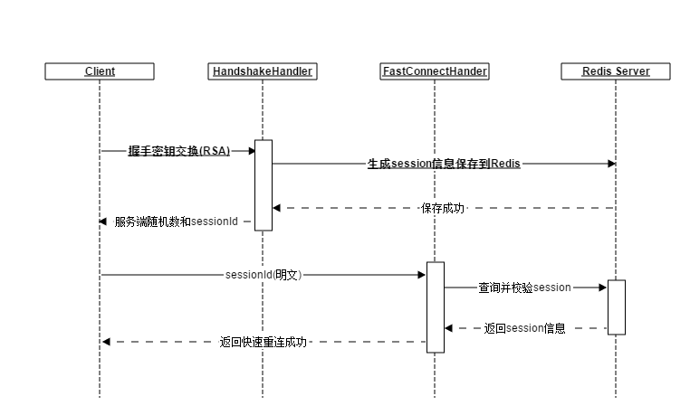
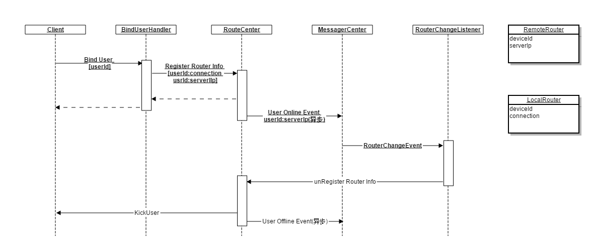
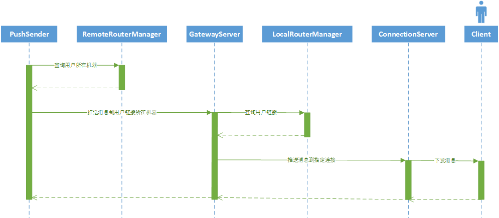
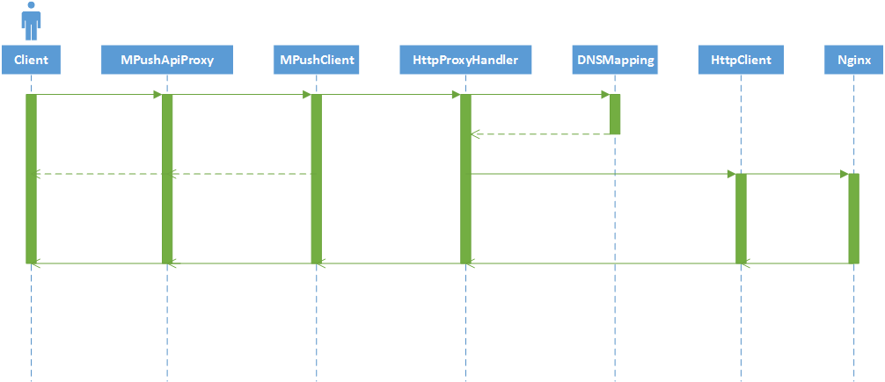
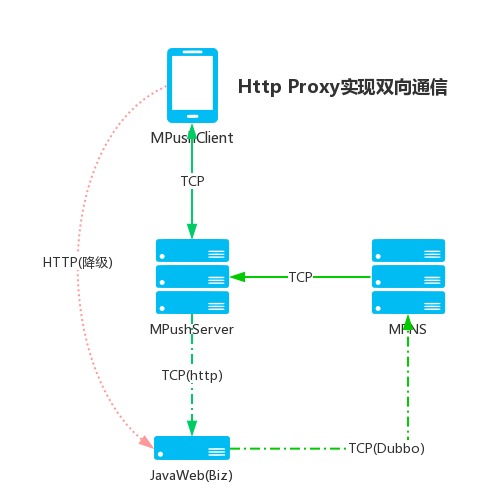
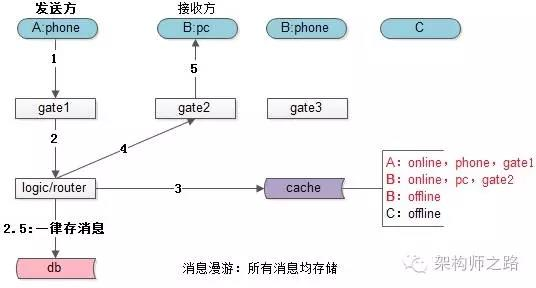
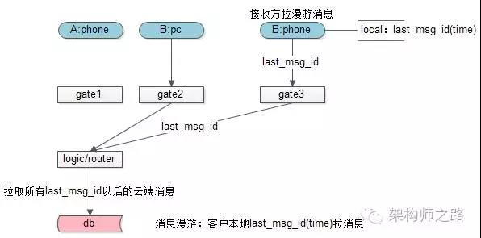

深度进阶    
1、握手及快速重连    
2、绑定用户    
3、MPNS 消息推送流程  
4、HTTP代理     
5、端到云-发消息  
6、广播推送与流控  
7、广播推送条件过滤  
8、消息漫游(未实现)  

# 握手及快速重连
  
* tcp连接建立后，第一个消息就是握手或快速重连消息。
* Handshake的目的是为了生成会话密钥，同时会把生成好的密钥存储到redis，并把key返回给客户端，为快速重连使用
* FastConnect是基于Handshake生成的sessionId来配合使用的，目的是为了减少RSA加密的使用次数，特别是网络较差的情况，毕竟RSA加密想对还是比较耗时的，客户端只需把sessionId传给服务端，其就能从redis中取出上次会话信息，恢复到上次握手成功之后的会话状态，这个过程不需要任何加密和密钥交换，相对会比较快速。

# 绑定用户
  
* 握手成功后表示安全通道已经建立，但同时还要给连接设置用户甚至标签，只有这样业务才能更好的去识别用户（没有用户的业务是另外一回事）。
* 设置用户非常简单，只需把其存储到session即可，但因为要支持集群的，就必须把用户的位置信息（或者叫路由信息）发布出去，让集群里的其他机器能够通过useId来查找用户的位置（在哪台机器），因为客户端的TCP连接在哪台机器，那么和这个客户端的所有数据传输都必须经过这台机器的这个连接！(很多同学会问为什么不把connection存储到redis)。
* 路由中心有两部分组成：本地路由和远程路由，本地路由数据结构为userId->connection的map，数据存储在本机内存；远程路由数据结构为userId->connServer机器ip，数据存储在redis;所以要给一个用户发信息必须先查远程路由，找到用户在哪台机器，然后把消息发给这台机器，让其去本地路由查找connection并通过查找到的TCP连接把消息发给用户。
* MessageCenter之前使用的redis提供的pub/sub实现的，也可以自己搭建MQ来实现，最新版踢人已经不再使用pub/sub，而是直接使用udp网关实现。
* 踢人：之所以会有踢人的情况是根据业务需要来的，有些业务系统是不允许同一个用户在多个设备同时在线的，或者只允许不同类型的终端同时在线，比如QQ,手机和PC可以同时在线，但同一个帐号在两台PC登录时其中一个肯定会被踢下线，mpush的踢人要表达的也是同一个意思。
* 顺便提一下关于同时在线的策略，或者说端的类型的定义mpush已经支持SPI定制化。

# MPNS 消息推送流程  
  
1、PushSender是消息推送的入口，它的实现在mpush-client模块属于服务端SDK，主要包含有GatewayClient, RemoteRouterManager; RemoteRouterManager用于定位用户在哪台机器，有没有在线等，而GatewayClient用于把要发送的的业务消息发给用户TCP连接所在的机器。

2、GatewayServer负责接收GatewayClient发送过来的消息，然后到LocalRouterManager查找用户的Connection，然后把消息交由其下发。

3、ConnectionServer 负责维持所有连接到当前机器的客户端连接，所以消息最终还是尤其下发（图比较简单，但能表达核心流程）。

# HTTP代理
## 使用场景
### 问题
前面有提到过http代理这个东西，但很多人不知道这个东西该怎么用，或者说有什么用？以及在什么场景下使用？     
### 移动APP通信场景分析
从使用的链接情况来看，一般可以分为两大类：TCP长链接，HTTP短链接；长链接用于消息推送或IM等场景，HTTP用于业务数据的查询或修改。虽然不是所有的APP都需要IM功能，但大多应用都需要消息推送功能。为了推送消息，APP必须维持一根长链接，但大部分时间除了心跳这根链接上是没多少消息在传输的，特别是非IM类的APP，因为这类应用并没大量的消息要不停的推送，维持长链接只是为了消息的及时到达，这势必造成了很大的资源浪费！
### 解决方案
针对上述情况MPUSH提供了Http代理方案，目的一是充分利用push通道，而是提高数据传输效率节省电量，节省流量，提供比http更高的安全性。
### 实现原理
MPushClient 提供了一个叫sendHttp的方法，该方法用于把客户端原本要通过HTTP方式发送的请求，全部通过PUSH通道转发，实现整个链路的长链接化；通过这种方式应用大大减少Http短链接频繁的创建，不仅仅节省电量，经过测试证明请求时间比原来至少缩短一倍，而且MPush提供的还有数据压缩功能，对于比较大的数据还能大大节省流量(压缩率4-10倍)，更重要的是所有通过代理的数据都是加密后传输的，大大提高了安全性！

## 使用方式
### 服务端
1、修改mpush.conf增加mp.http.proxy-enabled=true启用http代理  
2、修改mpush.conf增加dns-mapping配置，示例如下  
```
mp.http.dns-mapping={//域名映射外网地址转内部IP
  "api.jituancaiyun.com":["10.0.10.1:8080", "10.0.10.2:8080"]
}
```
说明：因为mpush server要做http代理转发，而客户端传过来的一般是域名比如http://api.jituancaiyun.com/get/userInfo.json为了不到公网上再绕一圈建议把mpush server 和业务服务(api.jituancaiyun.com)部署到同一个局域网，并增域名api.jituancaiyun.com到提供该服务的集群机器内网ip之间的一个映射，这样mpush server就可以通过局域网把请求转发到具体到业务服务，效率更高！

### 客户端
1、设置ClientConfig.setEnableHttpProxy(true)来启用客户端代理。  
2、通过Client.sendHttp(HttpRequest request)方法来发送请求。  
AndroidSDK通过com.mpush.android.MPush#sendHttpProxy(HttpRequest request)来发送比较合适。

## 流程分析

    

* Client代表App业务比如查询用户信息的接口
* MPushApiProxy是一个工具类用于负责处理当前请求是使用普通的HTTP还是使用MPush长链接通道，这个类在SDK中说不存在的，是我们公司内部的业务，实现起来也很简单，建议Android工程中增加这么一个角色，而不是到处直接去依赖Mpush的代码，方便以后解耦。
* MPushClient这个SDK已经提供，用于把Http协议打包成mpush协议。
* HttpProxyHandler包括后面的几个组件都是服务端业务组件。用于接收客户端传过来的请求并反解为Http协议，然后通过DNSMapping找到域名对应的局域网IP，再通过内置的HttpClient，把请求转发给业务WEB服务，并把业务服务的返回值(HttpResponse)打包成MPush协议发送到客户端。
* DNSMapping负责通过域名解析成局域网IP，并具有负载均衡以及简单的健康检查功能(针对所配置的WEB服务)
* HttpClient目前使用的是用Netty实现的全异步的一个HttpClient，负责通过http的方式请求业务服务。
* Nginx是业务服务，也可以是Tomcat，特别需要建议的是链接超时时间配置长一些。

## 为什么要这样实现？
为什么要这样实现？因为这样做对原有的业务系统侵入特别低，如果MPushApiProxy这个组件设计的好，对于最两边的业务组件/服务(Client,Nginx)，对请求方式应该是无感知的，这个角色是无法区分到底请求是通过普通的Http方式发送出去的还是通过长链接代理的方式发送的！！！  
另附上通过Http Proxy 实现双向通信交互图

    


# 端到云-发消息  
## 接口产生背景
作为一个纯粹推送系统，最初是没有发送上行消息接口的只有下行的消息，毕竟MPush不是IM系统。
后来在很多同学的要求下，就增加了此接口用于cleint上报消息。

## 接口的使用
此接口和服务端下行Push保持相同的协议，可以互发消息，默认服务端没有对消息做任何业务上的处理，收到后直接丢弃。  
同时MPush提供了SPI的方式来接管客户端发过来的消息，具体请参考[第三章 系统架构 - SPI定制化](http://mpush.mydoc.io/?v=24639&t=134851)。  
如果没有特殊需求客户端上行消息建议使用Http Proxy模式。

# 广播推送与流控  
## 什么是广播推送？
按推送用户范围来划分，MPush目前支持三种方式的推送：
* 单用户推送，推送消息给指定的某个用户。
* 批量推送，业务自己圈定一批用户，推送同一条消息给圈定的用户。
* 全网推送，推送消息给所有的在线用户。 这里所说的广播推送指的就是第三种用户范围的推送。

## 为什么广播推送要控制流量？
因为要推送消息给全网在线用户，用户量可能非常大，为了防止瞬时流量过大，所有加了入了防过载保护：流量控制。

## 流量控制的使用
* 单任务流量控制
* 全局流量控制

# 广播推送条件过滤  
## 为什么要对用户进行过滤？
因为广播是针对所有在线用户，为了更精准的推送，必须对目标用户进行筛选，才能满足个性化的业务需求。

## 目前支持的筛选纬度
* tag：业务自己打的标签
* userId：用户登录ID
* clientVersion：客户端版本
* osName：客户端系统平台
* osVersion：客户端系统版本

## 目前支持的表达式
目前只支持jvm内置的`Nashorn`脚本引擎，语法为javascript标准语法。

## 使用用例
具体请参照com.mpush.api.push.PushContext.java
* 灰度20%的在线用户：`userId % 100 < 20`
* 包含test标签的用户：`tags!=null && tags.indexOf("test")!=-1`
* 客户端版本号大于2.0的安卓用户：`clientVersion.indexOf("android")!=-1 && clientVersion.replace(/[^\d]/g,"") > 20`

# 消息漫游(未实现)
如果不需要支持“消息漫游”，对于在线消息，如果用户接收到，是不需要存储到数据库的。但如果要支持“换一台机器也能看到历史的聊天消息”，就需要对所有消息进行存储。
  

消息投递如上图，用户A发送消息给用户B，虽然B在线，仍然要增加一个步骤2.5，`在投递之前进行存储，以备B的其他端登陆时，可以拉取到历史消息。`
  

消息拉取如上图，原本不在线的B(phone端)重新登录了，怎么拉取历史消息呢？  
`只需要在客户端本地存储一个上一次拉取到的msg_id(time)`，到服务端重新拉取即可。

这里还有个问题，由于服务端存储所有消息成本是非常高的，所以一般“消息漫游”是有时间（或者消息数）限制，`不能拉取所有所有几年前的历史消息`，只能拉取最近的云端消息。

参考 架构师之路：
https://mp.weixin.qq.com/s/gHnq-VqRSBX-UiGd306NDw  《微信多点登录，消息漫游，假如让你来实现？》
