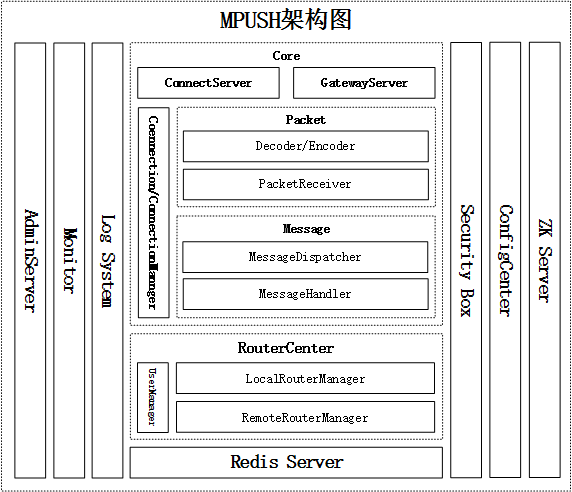
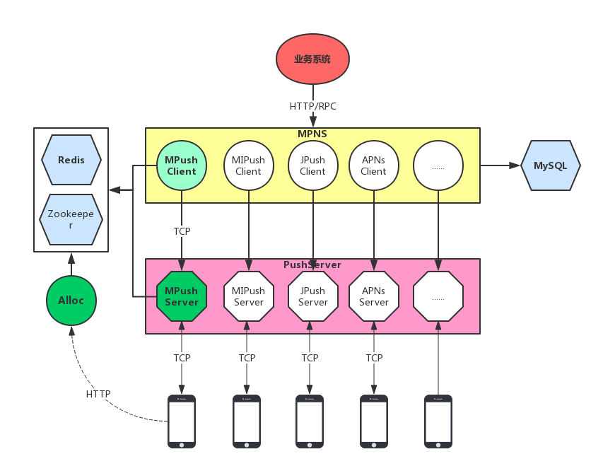
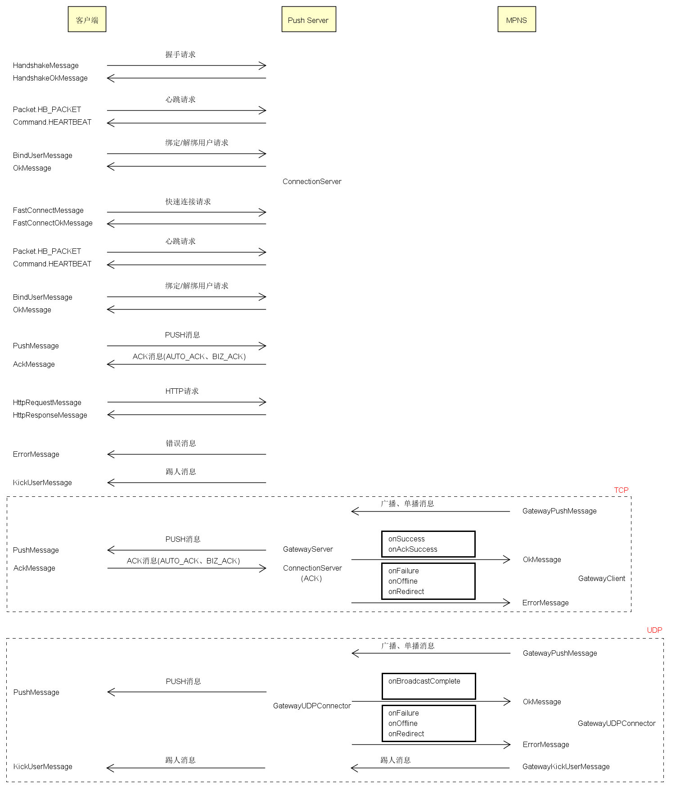
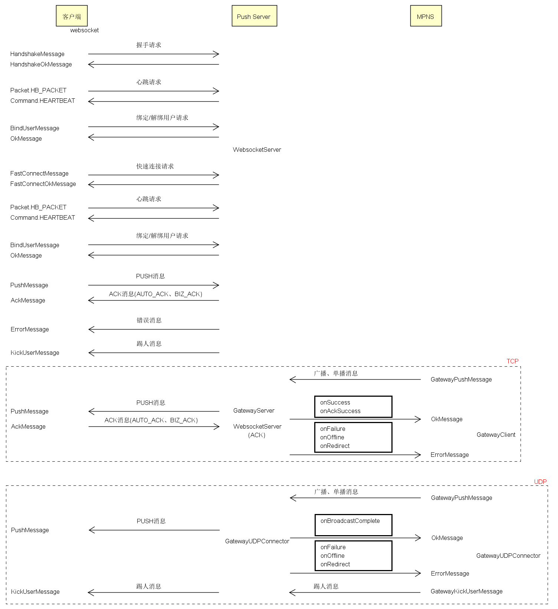
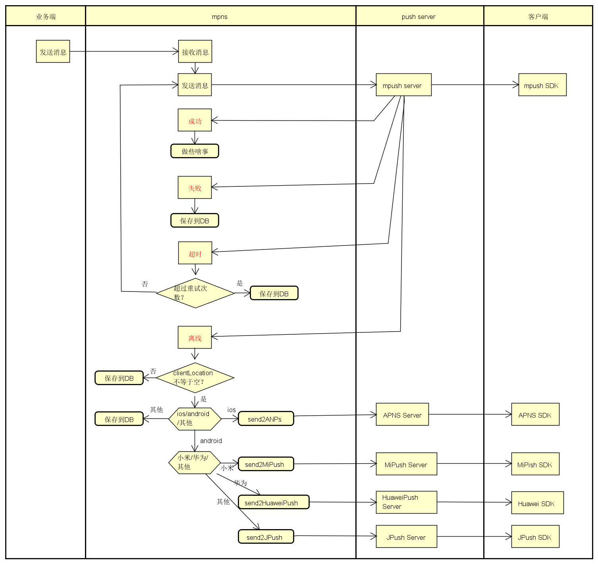

系统架构说明  
1、逻辑架构  
2、服务调用关系  
3、Mpush server启动模块  
4、消息传递流程(接入服务/Websocket服务)  
5、云到端消息推送流程  

# 逻辑架构  

  

1、最左侧三大组件分别是日志系统、监控系统、控制台治理服务
* Log System 主要负责业务日志大输出，主要有链接相关日志、推送链路日志、心跳日志、监控日志等
* Monitor 主要用作系统状态监控，可用于系统调优，包括jvm内存，线程，线程池，系统堆栈，垃圾回收情况，内存泄漏情况等。
* AdminServer主要用于在控制台对单台机器进行控制与探查，比如参看连接数量，在线用户数，取消本级ZK注册，关闭服务等

2、右侧三个分别是ZK服务，配置中心和安全工具箱
* ZK Client 主要负责注册长链接ip:port,网关ip:port以及监听各个节点变化，同时增加了缓存
* ConfigCenter 是MPUSH Server 配置化的关键，贯穿到各个模块，非常重要
* Sercutity Box 主要实现了RSA加密，DES加密，会话密钥生成及Session复用(用于快速重连)

3、Core模块分别是长链接服务，网关服务，Packet编解码及分发模块，Message序列化及处理模块
* ConnectServer用于维持和客户端之间的TCP通道，主要负责和客户端交互
* GatewayServer用于处理Mpush Server之间的消息交互比如踢人，发送PUSH
* Packet主要是协议部分的编解码和包的完整性校验，最大长度校验等
* PacketReceiver主要负责消息的分发，分发是根据Command来的
* Connection/ConnectionManager主要负责链接管理，定时检查链接空闲情况，是否读写超时，如果链接断开发出相应的事件给路由中心去处理
* Message部分是整个的业务核心处理了处理消息的序列化，还有压缩、加密等，MessageHandler会根据不同消息独立处理自己所属的业务，主要有：心跳响应、握手及密钥交换、快速重连、绑定/解绑用户、http代理、消息推送等

4、路由中心主要包括：本地路由，远程路由，用户在线管理三大块
* LocalRouterManager负责维护用户＋设备与链接(connection)之间的关系
* RemoteRouterManager负责维护用户＋设备与链接所在机器IP之间的关系
* UserManager主要处理用户上下线事件的广播，以及单台机器的在线用户及数量的维护和查询
5、MPUSH的缓存部分，目前只支持Redis,支持双写，主备，hash 等特性

见其官网说明：http://mpush.mydoc.io/?t=134339

# 服务依赖关系  

* 业务系统是要发送业务消息的服务，所有要推送的消息直接转给MPNS
* MPNS是我们的业务推送系统，负责消息推送，长链接的检查，离线消息存储，用户打标等
* APNS、JPUSH、MPUSH等分别是我们的客户端已经接入的推送系统
* MPNS主要是为了隔离业务系统和各种推送系统，用户使用哪个长链接服务，业务系统不需要感知，统一有MPNS去选择、去切换
* Alloc负责调度维护MPushServer集群，提供查询可用机器列表的接口，详细参见[Alloc实现]

# Mpush server启动模块  

# 消息传递流程(接入服务/Websocket服务)  
## 接入服务

## Websocket服务

# 云到端消息推送流程  

