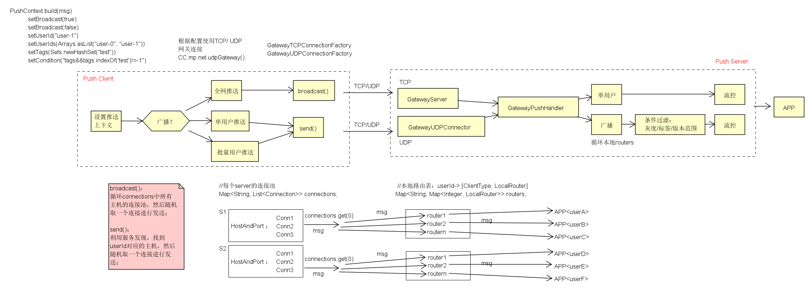

  

UDP服务启动类
```java
public final class GatewayUDPConnector extends NettyUDPConnector {

    private UDPChannelHandler channelHandler;
    private MessageDispatcher messageDispatcher;
    private MPushServer mPushServer;

    public GatewayUDPConnector(MPushServer mPushServer) {
        super(CC.mp.net.gateway_server_port);
        this.mPushServer = mPushServer;
        this.messageDispatcher = new MessageDispatcher(POLICY_LOG);
        this.channelHandler = new UDPChannelHandler(messageDispatcher);
    }

    @Override
    public void init() {
        super.init();
        messageDispatcher.register(Command.GATEWAY_PUSH, () -> new GatewayPushHandler(mPushServer.getPushCenter()));
        messageDispatcher.register(Command.GATEWAY_KICK, () -> new GatewayKickUserHandler(mPushServer.getRouterCenter()));
        channelHandler.setMulticastAddress(Utils.getInetAddress(CC.mp.net.gateway_server_multicast));
        channelHandler.setNetworkInterface(Utils.getLocalNetworkInterface());
    }

    @Override
    protected void initOptions(Bootstrap b) {
        super.initOptions(b);
        b.option(ChannelOption.IP_MULTICAST_LOOP_DISABLED, true);//默认情况下，当本机发送组播数据到某个网络接口时，在IP层，数据会回送到本地的回环接口，选项IP_MULTICAST_LOOP用于控制数据是否回送到本地的回环接口
        b.option(ChannelOption.IP_MULTICAST_TTL, 255);//选项IP_MULTICAST_TTL允许设置超时TTL，范围为0～255之间的任何值
        //b.option(ChannelOption.IP_MULTICAST_IF, null);//选项IP_MULTICAST_IF用于设置组播的默认网络接口，会从给定的网络接口发送，另一个网络接口会忽略此数据,参数addr是希望多播输出接口的IP地址，使用INADDR_ANY地址回送到默认接口。
        //b.option(ChannelOption.WRITE_BUFFER_WATER_MARK, new WriteBufferWaterMark(32 * 1024, 1024 * 1024));
        if (snd_buf.gateway_server > 0) b.option(ChannelOption.SO_SNDBUF, snd_buf.gateway_server);
        if (rcv_buf.gateway_server > 0) b.option(ChannelOption.SO_RCVBUF, rcv_buf.gateway_server);
    }

    @Override
    public ChannelHandler getChannelHandler() {
        return channelHandler;
    }

    public Connection getConnection() {
        return channelHandler.getConnection();
    }

    public MessageDispatcher getMessageDispatcher() {
        return messageDispatcher;
    }
}

```

广播消息处理：
```java
@ChannelHandler.Sharable
public final class UDPChannelHandler extends ChannelInboundHandlerAdapter {
    private static final Logger LOGGER = LoggerFactory.getLogger(UDPChannelHandler.class);
    private final NettyConnection connection = new NettyConnection();
    private final PacketReceiver receiver;
    private InetAddress multicastAddress;
    private NetworkInterface networkInterface;

    public UDPChannelHandler(PacketReceiver receiver) {
        this.receiver = receiver;
    }

    @Override
    public void channelActive(ChannelHandlerContext ctx) throws Exception {
        connection.init(ctx.channel(), false);
        if (multicastAddress != null) {
            ((DatagramChannel) ctx.channel()).joinGroup(multicastAddress, networkInterface, null).addListener(future -> {
                if (future.isSuccess()) {
                    LOGGER.info("join multicast group success, channel={}, group={}", ctx.channel(), multicastAddress);
                } else {
                    LOGGER.error("join multicast group error, channel={}, group={}", ctx.channel(), multicastAddress, future.cause());
                }
            });
        }
        LOGGER.info("init udp channel={}", ctx.channel());
    }

    @Override
    public void channelInactive(ChannelHandlerContext ctx) throws Exception {
        connection.close();
        if (multicastAddress != null) {
            ((DatagramChannel) ctx.channel()).leaveGroup(multicastAddress, networkInterface, null).addListener(future -> {
                if (future.isSuccess()) {
                    LOGGER.info("leave multicast group success, channel={}, group={}", ctx.channel(), multicastAddress);
                } else {
                    LOGGER.error("leave multicast group error, channel={}, group={}", ctx.channel(), multicastAddress, future.cause());
                }
            });
        }
        LOGGER.info("disconnect udp channel={}, connection={}", ctx.channel(), connection);
    }

    @Override
    public void channelRead(ChannelHandlerContext ctx, Object msg) throws Exception {
        DatagramPacket datagramPacket = (DatagramPacket) msg;
        Packet packet = PacketDecoder.decodeFrame(datagramPacket);
        receiver.onReceive(packet, connection);
        datagramPacket.release();//最后一个使用方要释放引用
    }

    @Override
    public void exceptionCaught(ChannelHandlerContext ctx, Throwable cause) throws Exception {
        connection.close();
        LOGGER.error("udp handler caught an exception, channel={}, conn={}", ctx.channel(), connection, cause);
    }

    public UDPChannelHandler setMulticastAddress(InetAddress multicastAddress) {
        if (!multicastAddress.isMulticastAddress()) {
            throw new IllegalArgumentException(multicastAddress + "not a multicastAddress");
        }

        this.multicastAddress = multicastAddress;
        return this;
    }

    public UDPChannelHandler setNetworkInterface(NetworkInterface networkInterface) {
        this.networkInterface = networkInterface;
        return this;
    }

    public Connection getConnection() {
        return connection;
    }
}

```
