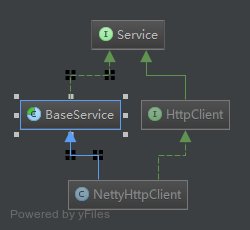

主要用于服务的启动和停止，子类只需要继承BaseService类，然后调用其start、stop方法；

  

启动服务：
```java
mPushServer.getHttpClient().syncStart();
//或者
mPushServer.getHttpClient().start();
```

停止服务：
```java
mPushServer.getHttpClient().syncStop();
//或者
mPushServer.getHttpClient().stop();
```

子类中的启动、停止方法实现：
```java
@Override
protected void doStart(Listener listener) throws Throwable {
    //....实现相关的启动业务

    //通知监听器，表示该操作已经完成
    listener.onSuccess();
}
@Override
protected void doStop(Listener listener) throws Throwable {
    //....实现相关的停止业务

    //通知监听器，表示该操作已经完成
   listener.onSuccess();
}
```

BaseService.java
```java
package com.mpush.api.service;

import java.util.concurrent.CompletableFuture;
import java.util.concurrent.atomic.AtomicBoolean;

/**
 * Created by yxx on 2016/5/19.
 *
 * @author ohun@live.cn
 */
public abstract class BaseService implements Service {

    protected final AtomicBoolean started = new AtomicBoolean();

    @Override
    public void init() {
    }

    @Override
    public boolean isRunning() {
        return started.get();
    }

    protected void tryStart(Listener l, FunctionEx function) {
        FutureListener listener = wrap(l);
        if (started.compareAndSet(false, true)) {
            try {
                init();
                function.apply(listener);
                listener.monitor(this);//主要用于异步，否则应该放置在function.apply(listener)之前
            } catch (Throwable e) {
                listener.onFailure(e);
                throw new ServiceException(e);
            }
        } else {
            if (throwIfStarted()) {
                listener.onFailure(new ServiceException("service already started."));
            } else {
                listener.onSuccess();
            }
        }
    }

    protected void tryStop(Listener l, FunctionEx function) {
        FutureListener listener = wrap(l);
        if (started.compareAndSet(true, false)) {
            try {
                function.apply(listener);
                listener.monitor(this);//主要用于异步，否则应该放置在function.apply(listener)之前
            } catch (Throwable e) {
                listener.onFailure(e);
                throw new ServiceException(e);
            }
        } else {
            if (throwIfStopped()) {
                listener.onFailure(new ServiceException("service already stopped."));
            } else {
                listener.onSuccess();
            }
        }
    }

    public final CompletableFuture<Boolean> start() {
        FutureListener listener = new FutureListener(started);
        start(listener);
        return listener;
    }

    public final CompletableFuture<Boolean> stop() {
        FutureListener listener = new FutureListener(started);
        stop(listener);
        return listener;
    }

    @Override
    public final boolean syncStart() {
        return start().join();
    }

    @Override
    public final boolean syncStop() {
        return stop().join();
    }

    @Override
    public void start(Listener listener) {
        tryStart(listener, this::doStart);
    }

    @Override
    public void stop(Listener listener) {
        tryStop(listener, this::doStop);
    }

    protected void doStart(Listener listener) throws Throwable {
        listener.onSuccess();
    }

    protected void doStop(Listener listener) throws Throwable {
        listener.onSuccess();
    }

    /**
     * 控制当服务已经启动后，重复调用start方法，是否抛出服务已经启动异常
     * 默认是true
     *
     * @return true:抛出异常
     */
    protected boolean throwIfStarted() {
        return true;
    }

    /**
     * 控制当服务已经停止后，重复调用stop方法，是否抛出服务已经停止异常
     * 默认是true
     *
     * @return true:抛出异常
     */
    protected boolean throwIfStopped() {
        return true;
    }

    /**
     * 服务启动停止，超时时间, 默认是10s
     *
     * @return 超时时间
     */
    protected int timeoutMillis() {
        return 1000 * 10;
    }

    protected interface FunctionEx {
        void apply(Listener l) throws Throwable;
    }

    /**
     * 防止Listener被重复执行
     *
     * @param l listener
     * @return FutureListener
     */
    public FutureListener wrap(Listener l) {
        if (l == null) return new FutureListener(started);
        if (l instanceof FutureListener) return (FutureListener) l;
        return new FutureListener(l, started);
    }
}

```

```java
package com.mpush.api.service;

import java.util.concurrent.CompletableFuture;
import java.util.concurrent.TimeUnit;
import java.util.concurrent.atomic.AtomicBoolean;

public class FutureListener extends CompletableFuture<Boolean> implements Listener {
    private final Listener listener;
    private final AtomicBoolean started;

    public FutureListener(AtomicBoolean started) {
        this.started = started;
        this.listener = null;
    }

    public FutureListener(Listener listener, AtomicBoolean started) {
        this.listener = listener;
        this.started = started;
    }

    @Override
    public void onSuccess(Object... args) {
        if (isDone()) return;// 防止Listener被重复执行
        complete(started.get());
        if (listener != null) listener.onSuccess(args);
    }

    @Override
    public void onFailure(Throwable cause) {
        if (isDone()) return;// 防止Listener被重复执行
        completeExceptionally(cause);
        if (listener != null) listener.onFailure(cause);
        throw cause instanceof ServiceException
                ? (ServiceException) cause
                : new ServiceException(cause);
    }

    /**
     * 防止服务长时间卡在某个地方，增加超时监控
     *
     * @param service 服务
     */
    public void monitor(BaseService service) {
        if (isDone()) return;// 防止Listener被重复执行
        runAsync(() -> {
            try {
                this.get(service.timeoutMillis(), TimeUnit.MILLISECONDS);
            } catch (Exception e) {
                this.onFailure(new ServiceException(String.format("service %s monitor timeout", service.getClass().getSimpleName())));
            }
        });
    }

    @Override
    public boolean cancel(boolean mayInterruptIfRunning) {
        throw new UnsupportedOperationException();
    }

}

```

<br>
 功能组件文章目录:

* [CC-配置中心](../CC-配置中心)
* [EventBus-事件总线](../EventBus-事件总线)
* [FlowControl-流控](../FlowControl-流控)
* [JVMUtil](../JVMUtil)
* [Logs](../Logs)
* [Profiler-统计方法或者线程执行时间](../Profiler-统计方法或者线程执行时间)
* [Profiler入门](../Profiler入门)
* [SPI机制](../SPI机制)
* [TimeLine-时间线](../TimeLine-时间线)
* **[服务启动监听](../服务启动监听)**
* [监控](../监控)
* [通信模型与超时控制](../通信模型与超时控制)
* [线程池](../线程池)
* [状态判断-位运算](../状态判断-位运算)
