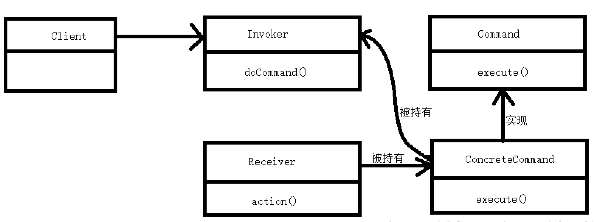

# 作用与场景
* 调用者与执行者之间解耦；  
* 用于需要用不同的命令，做不同的业务逻辑处理，如网络通信client与server之间互相传输的不同命令(登录、登出、握手、发消息等，见开源实现[SOFA-Bolt](https://github.com/alipay/sofa-bolt))；

# 命令模式的几个角色
* 抽象命令接口Command：定义命令的接口，声明执行的方法。
* 具体的命令对象ConcreteCommand：持有具体的接受者对象，完成具体的具体的命令。
* 接受者对象Receiver：接受者对象，真正执行命令的对象。
* 传递命令对象Invoker：持有命令对象，要求命令对象执行请求。
* 客户端对象Client：创建具体命令的对象并且设置命令对象的接受者。

# 命令模式关系图


# 示例：
假设我现在拿个玩具遥控器(invoker)，当我按唱歌按钮(ConcreteCommand)，玩具(receiver)就唱歌，当我按跳舞按钮(ConcreteCommand)，玩具(receiver)就跳舞。

## 抽象命令接口Command：
```java
/**
 * 命令接口
 */
public interface Command {
    /**
     * 执行命令
     */
    void execute();
}
```
## 具体的命令对象ConcreteCommand：（唱歌命令）
```java
/**
 * 唱歌命令
 */
public class SingCommand implements Command{

    //玩具接口类
    private Toys toys;

    /**
     * 创建唱歌命令的时候，传入具体的玩具对象
     * @param toys
     */
    public SingCommand(Toys toys) {
        this.toys = toys;
    }

    /**
     * 调用玩具对象的唱歌接口
     */
    @Override
    public void execute() {
        toys.sing();
    }
}
```
## 具体的命令对象ConcreteCommand：（跳舞命令）
```java
/**
 * 跳舞命令
 */
public class DanceCommand implements Command{

    //玩具接口类
    private Toys toys;

    /**
     * 创建唱歌命令的时候，传入具体的玩具对象
     * @param toys
     */
    public DanceCommand(Toys toys) {
        this.toys = toys;
    }

    /**
     * 调用玩具对象的跳舞接口
     */
    @Override
    public void execute() {
        toys.dance();
    }
}
```
## 接受者对象Receiver：
```java
/**
 * 玩具接口(真正的命令执行者接口)
 */
public interface Toys{
    void sing();
    void dance();
}


/**
 * 凹凸曼
 */
public class Ultraman implements Toys{

    /**
     * 唱歌方法
     */
    @Override
    public void sing() {
        System.out.println("泰罗之光，粉碎吧！！");
    }

    /**
     * 跳舞方法
     */
    @Override
    public void dance() {
        System.out.println("谈恋爱不如跳舞！！");
    }
}
```

## 传递命令对象Invoker：
```java
/**
 * 遥控器
 */
public class Controller {

    private Command command;

    /**
     * 设置具体的命令
     * @param command
     */
    public void setCommand(Command command) {
        this.command = command;
    }

    /**
     * 执行命令
     */
    public void doCommand() {
        command.execute();
    }
}
```

## 客户端对象：
```java
/**
 * 小孩子
 */
public class Client {

    public static void main(String[] args) {
        // 需要有个遥控器（Invoker）
        Controller controller = new Controller();
        // 需要有个玩具（Receiver）
        Toys toys = new Ultraman();
        // 需要有个唱歌按钮(ConcreteCommand)
        SingCommand singCommand = new SingCommand(toys);
        System.out.println("按下唱歌按钮！");
        controller.setCommand(singCommand);
        System.out.println("开始唱歌。。。");
        controller.doCommand();

        System.out.println("-------------------------------------------------");

        // 需要有个跳舞按钮(ConcreteCommand)
        DanceCommand danceCommand = new DanceCommand(toys);
        System.out.println("按下跳舞按钮！");
        controller.setCommand(danceCommand);
        System.out.println("开始跳舞。。。");
        controller.doCommand();

    }
}
```

测试结果：
```
按下唱歌按钮！
开始唱歌。。。
-------------------------------------------------
按下跳舞按钮！
开始跳舞。。。
```

# 总结：
上面的例子仅仅是实现单个命令的的命令模式，而命令模式是可以相当复杂的，就比如说，你让机器人同时唱歌、跳舞、画画等等，这时候我们可以将多个命令存储起来，然后一次性执行。

# 命令模式优缺点：
优点：  
* 实现客户端和接受者之间的解耦(由遥控器代执行我的命令)
* 可以动态的添加新的命令。
* (遥控器)只需要调用同一个方法（doCommand方法）便可以实现不同的功能。

缺点：  
* 每一个具体命令都是一个类，可能要创建很多的命令类，注意类的膨胀扩张。

<br>
 设计模式系列文章:

* **[1-命令模式Command](../1-命令模式Command)**
* [2-责任链模式Filter](../2-责任链模式Filter)
* [3-策略模式Strategy](../3-策略模式Strategy)

<H2><font style="color:red">写得不好，仅供参考！</font></H2>
