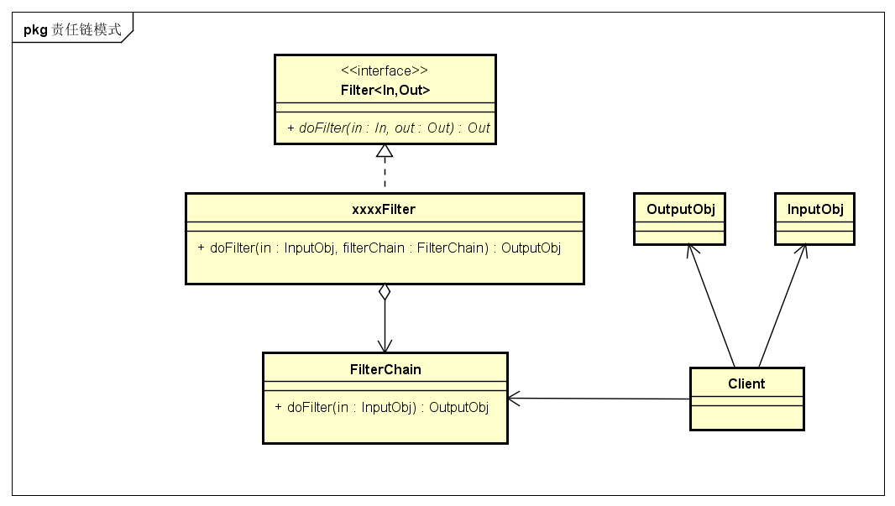
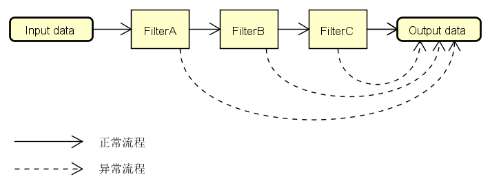

# 作用与场景
过滤或者拦截数据；  
servlet中的filter、mvc中的拦截器、dubbo中的filter、消费者对重复消息/垃圾消息的过滤等

# 责任链模式的几个角色
* 入口数据对象inputObj：传入到责任链中流转的数据
* 出口数据对象outputObj：责任链处理完之后的对象
* 责任链对象xxxxFilter：不同的责任链对象，负责不同的责任
* 责任链对象集合FilterChain：存储所有责任链对象，存储数据处理对象
* 客户端对象Client：执行具体的责任链

# 责任链模式关系图


# 举例：
MQ消费者对重复消息/垃圾消息的过滤(其实是拦截器)；  
正常流程：如果消息没被过滤掉，则做保存处理；  
异常流程：如果碰到的是重复消息或者垃圾消息，则直接跳过后面的Filter，然后做丢弃处理;  


## 入口数据对象inputObj
```java
class Request {
    private String name = "123";
        String getName() {
        return name;
    }
    void setName(String name) {
        this.name = name;
    }
}
```

## 出口数据对象outputObj
```java
class Response {
    private String name;
      String getName() {
        return name;
    }
    void setName(String name) {
        this.name = name;
    }
}
```

## 责任链对象xxxxFilter
```java
/**
* Filter接口
*/
interface Filter<Input,Output> {  
    Output doFilter(Input input, FilterChain filterChain);
}

/**
* 过滤重复消息
*/
public class RepeatFilter implements Filter<Request,Response>{
    @Override
    Response doFilter(Request req, FilterChain filterChain) {
        //可以附加一些信息
        req.setName(req.getName() + "aaa");
        //重复消息判定
        Boolean isRepeat= xxxService.isRepeat();
        if(isRepeat){
            return null;
        }
        return filterChain.doFilter(req);
    }
}

/**
* 过滤垃圾消息
*/
public class RubbishFilter implements Filter<Request,Response>{
    @Override
    Response doFilter(Request req, FilterChain filterChain) {
        //可以附加一些信息
        req.setName(req.getName() + "bbb");
        //垃圾消息判定
        Boolean isRubbish= xxxService.isRubbish();
        if(isRubbish){
            return null;
        }
        return filterChain.doFilter(req);
    }
}
```

## 责任链对象集合FilterChain
```java
class FilterChain {
    private static List<Filter> filters = new ArrayList<>();
    static void addFilter(Filter filter) {
        filters.add(filter);
    }
    private int pos = 0;
    Response doFilter(Request request) {
        if (pos < filters.size()) {
            Filter filter = filters.get(pos++);
            return filter.doFilter(request, this);
        }
    }
}
```

## 客户端对象Client
```java
public class Client {
      static void main(String[] args) {
        FilterChain filterChain = new FilterChain();
        FilterChain.addFilter(new RepeatFilter());
        FilterChain.addFilter(new RubbishFilter());
        Response response = filterChain.doFilter(new Request());
        if(response == null){
            System.out.println("丢弃消息....");
        }else{
           System.out.println("保存消息....");
       }
    }
}
```

# 责任链模式总结：
优点：  
* 可以扩展多种过滤业务，方便后续维护；

缺点：  
* 责任链太长或者每条链判断处理的时间太长会影响性能；
* 每次都是从链头开始：这也正是链表的缺点。

<br>
 设计模式系列文章:

* [1-命令模式Command](../1-命令模式Command)
* **[2-责任链模式Filter](../2-责任链模式Filter)**
* [3-策略模式Strategy](../3-策略模式Strategy)


<H2><font style="color:red">写得不好，仅供参考！</font></H2>
