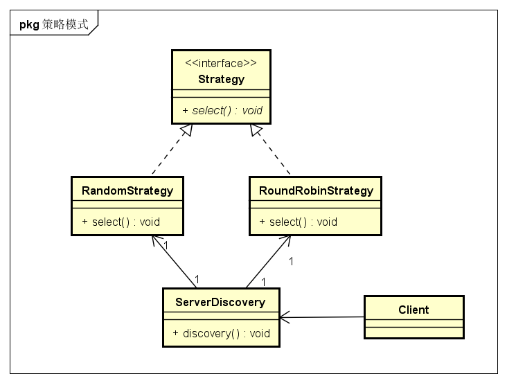

# 作用与场景
* 避免代码臃肿难以阅读，如非常多的if..else，参照单一原则，使每种事情得以抽象出来，代码结构更加清晰（曾经参加面试时，有面试官问，如果if..else过多怎么解决，当时一脸懵逼）；
* 常用于负载均衡策略的选择、商品税率、商品活动等场景，在很多开源中间件中也都有策略模式的影子（多看源码有好处）；

# 策略模式的几个角色：
* 策略接口Strategy
* 具体策略对象xxxxStrategy
* 执行策略对象invoker，内部持有一个策略类的引用
* 客户端对象Client

# 策略模式关系图


# 举例：
负载均衡策略的选择，包括随机、轮询、权重等

## 策略接口Strategy
```java
public class Strategy{
    Server select(List<Server> serverList);
}
```

## 具体策略对象xxxxStrategy

```java
/**
* 随机策略
*/
public class RandomStrategy implements Strategy{
    @Override
    public Server select(List<Server> serverList){
        //TODO随机算法实现
        //Server server= ...
        return server;
    }
}
```

```java
/**
* 轮询策略
*/
public class RoundRobinStrategy implements Strategy{
    @Override
    public Server select(List<Server> serverList){
        //TODO轮询算法实现
        //Server server= ...
        return server;
    }
}
```

## 执行策略对象invoker
```java
public class ServerDiscovery{
    private Strategy strategy;
    public ServerDiscovery(Strategy strategy){
        this.strategy=strategy;
    }
    public String discovery(String serverName){
        //获取所有服务节点
        List<Server> serverList= zkClient.lookup(serverName);
        //利用策略，选择一台节点
        Server server=strategy.select(serverList);
        return server.host+":"+server.port;
    }
}
```

## 客户端对象Client
```java
public class Client{
    static void main(String[] args) {
        //使用随机策略选择一台节点
        ServerDiscovery sd=new ServerDiscovery(new RandomStrategy());
        String hostAndPort=sd.discovery("SERVER_NAME");
        System.out.println(hostAndPort);
    }
}
```

# 总结：
这里只是抛砖引玉，更好的实现见spring cloud中的Ribbon负载均衡策略；

优点：  
* 避免代码臃肿难以阅读，如非常多的if..else，参照单一原则，使每种事情得以抽象出来，代码结构更加清晰；

缺点：  
* 客户端必须知道所有的策略类，并自行决定使用哪一个策略类。这就意味着客户端必须理解这些算法的区别，以便适时选择恰当的算法类。换言之，策略模式只适用于客户端知道算法或行为的情况。
* 由于策略模式把每个具体的策略实现都单独封装成为类，如果备选的策略很多的话，那么对象的数目就会很多(说缺点有些牵强，能多出来多少呢！)；


<br>
 设计模式系列文章:

* [1-命令模式Command](../1-命令模式Command)
* [2-责任链模式Filter](../2-责任链模式Filter)
* **[3-策略模式Strategy](../3-策略模式Strategy)**


<H2><font style="color:red">写得不好，仅供参考！</font></H2>
